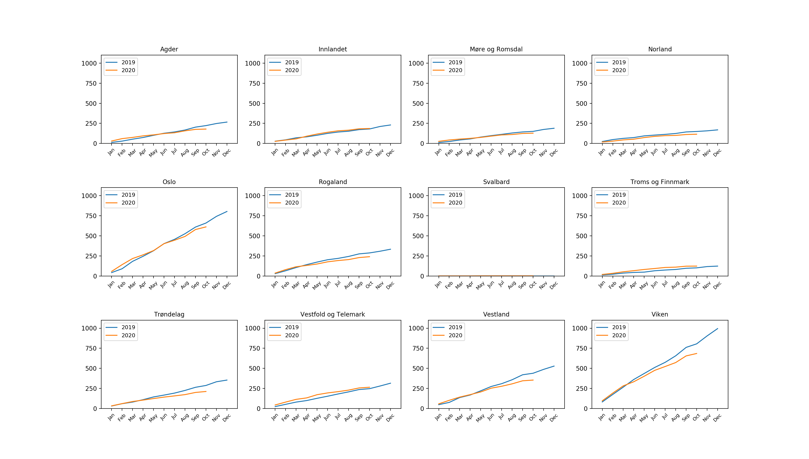

```{r setup, include=FALSE}
knitr::opts_chunk$set(echo = FALSE)
library(reticulate)
use_python("/usr/bin/python3.5", required = T)
```

### Cumulative number of bankruptcies per month in 2019 and 2020 per county

```{python, engine.path = '/usr/bin/python3.5', echo=FALSE, message=FALSE, results='hide'}

import calendar
from bs4 import BeautifulSoup
import pandas as pd
from requests import get
from datetime import date, datetime
import matplotlib.pyplot as plt


todays_day = date.today().day
todays_month = date.today().month
todays_year = date.today().year

def get_months_url(year):
  """ Get the URL for each month in the given year. """
  
  urls = []
  num_months = 12

  if year == todays_year:
    num_months = todays_month
  
  # Iterate each month of the year
  for i in range(1, num_months+1):
  
    # Get the first day of that month
    from_date = "{:02d}.{:02d}.{}".format(1, i, year)

    # Get the last day of that month
    to_date = "{:02d}.{:02d}.{}".format(calendar.monthrange(year, i)[1], i, year)

    if i == todays_month:
      to_date = "{:02d}.{:02d}.{}".format(todays_day, i, year)

    print(from_date, "-", to_date)

    url = "https://w2.brreg.no/kunngjoring/kombisok.jsp?datoFra={}&datoTil={}&id_region=0&id_niva1=51&id_niva2=-+-+-&id_bransje1=0".format(from_date, to_date)

    urls.append(url)

  return urls


def parse_month(url):
  """ Extract the number of 'Konkursåpning' for each individual county given the URLs. """

  response = get(url)
  html_soup = BeautifulSoup(response.text, 'html.parser')

  table = html_soup.find_all('table', attrs={'border':'0', 'width':'100%', 'cellspacing':'0', 'cellpadding':'0'})[1]
  table_rows = table.find_all('tr')

  res = []
  for tr in table_rows:
    td = tr.find_all('td')
    row = [tr.text.strip() for tr in td if tr.text.strip()]
    if len(row) == 1 or len(row) == 4:
      res.append(row)

  current = ""
  count = {}

  for row in res:

    if len(row) == 1:
      current = row[0]
      count[current] = 0

    if 'Konkursåpning' in row:
      count[current] += 1

  return count


def acumulative_add_elem(elem_list, dictionary, key):
  """ Acumulative append and element to a list. """

  elem = 0
  
  if key in dictionary:
    elem = dictionary[key]
  
  if len(elem_list) == 0:
    elem_list.append(elem)
    return elem_list
  
  new_elem = elem_list[len(elem_list)-1] + elem
  elem_list.append(new_elem)
  return elem_list


# Create a figure
fig = plt.figure()
axs = fig.subplots(nrows=3, ncols=4)

# Set the ticks and ticklabels for all axes
plt.setp(axs, xticks=[1, 2, 3, 4, 5, 6, 7, 8, 9, 10, 11, 12], xticklabels=['Jan', 'Feb', 'Mar', 'Apr', 'May', 'Jun', 'Jul', 'Aug', 'Sep', 'Oct', 'Nov', 'Dec'], yticks=[0, 250, 500, 750, 1000], ylim=[0, 1100], xlim=[0, 13])

# Set the fontsize and rotation for each ticklabels on the x-axes
for axe in axs.flat:
  for tick in axe.get_xticklabels():
    tick.set_fontsize(8) 
    tick.set_rotation(45)

# Set the title for each subplot
axs.flat[0].set_title('Agder', size=10)
axs.flat[1].set_title('Innlandet', size=10)
axs.flat[2].set_title('Møre og Romsdal', size=10)
axs.flat[3].set_title('Norland', size=10)
axs.flat[4].set_title('Oslo', size=10)
axs.flat[5].set_title('Rogaland', size=10)
axs.flat[6].set_title('Svalbard', size=10)
axs.flat[7].set_title('Troms og Finnmark', size=10)
axs.flat[8].set_title('Trøndelag', size=10)
axs.flat[9].set_title('Vestfold og Telemark', size=10)
axs.flat[10].set_title('Vestland', size=10)
axs.flat[11].set_title('Viken', size=10)

# Calculate the cumulative number of bankruptcies per month in 2019 and 2020 per county
for year in range(2019, 2021):

  agder = []
  innlandet = []
  more_og_romsdal = []
  nordland = []
  oslo = []
  rogaland = []
  svalbard = []
  troms_og_finnmark = []
  trondelag = []
  vestfold_og_telemark = []
  vestland = []
  viken = []
  
  months_urls = get_months_url(year)
  months = [i for i in range(1, len(months_urls)+1)]
  
  # Iterate over each month in the given year
  for month_url in months_urls:
    count = parse_month(month_url)

    agder = acumulative_add_elem(agder, count, 'Agder')
    innlandet = acumulative_add_elem(innlandet, count, 'Innlandet')
    more_og_romsdal = acumulative_add_elem(more_og_romsdal, count, 'Møre og Romsdal')
    nordland = acumulative_add_elem(nordland, count, 'Nordland')
    oslo = acumulative_add_elem(oslo, count, 'Oslo')
    rogaland = acumulative_add_elem(rogaland, count, 'Rogaland')
    svalbard = acumulative_add_elem(svalbard, count, 'Svalbard')
    troms_og_finnmark = acumulative_add_elem(troms_og_finnmark, count, 'Troms og Finnmark')
    trondelag = acumulative_add_elem(trondelag, count, 'Trøndelag')
    vestfold_og_telemark = acumulative_add_elem(vestfold_og_telemark, count, 'Vestfold og Telemark')
    vestland = acumulative_add_elem(vestland, count, 'Vestland')
    viken = acumulative_add_elem(viken, count, 'Viken')
  
  # Plot the year for each county
  axs.flat[0].plot(months, agder, label=str(year))
  axs.flat[1].plot(months, innlandet, label=str(year))
  axs.flat[2].plot(months, more_og_romsdal, label=str(year))
  axs.flat[3].plot(months, nordland, label=str(year))
  axs.flat[4].plot(months, oslo, label=str(year))
  axs.flat[5].plot(months, rogaland, label=str(year))
  axs.flat[6].plot(months, svalbard, label=str(year))
  axs.flat[7].plot(months, troms_og_finnmark, label=str(year))
  axs.flat[8].plot(months, trondelag, label=str(year))
  axs.flat[9].plot(months, vestfold_og_telemark, label=str(year))
  axs.flat[10].plot(months, vestland, label=str(year))
  axs.flat[11].plot(months, viken, label=str(year))


# Add height space between subplots
fig.subplots_adjust(hspace=0.5)

# Add legend to the upper left corner of each subplot
for ax in axs.flat:
  ax.legend(loc="upper left", prop={'size': 9})


fig.set_size_inches(18.5, 10.5)
fig.savefig('graph.png', dpi=200)

```



### No Covid-19 effect on bankruptcies, yet.
